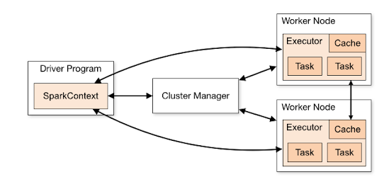

## Apache Spark

Topics to touch as concepts
- Transformations (lazy evaluation) vs Actions
- Driver vs Worker nodes

## Spark Cluster Topology 



Very Short Summary: Driver (submits) -> Master (manages) ->  Worker/Executor (pull data and process it)

In Spark Cluster, there are number of executors and each executor process one file at a time.
If we have one big file, then the file can be handled by only one executor and the rest of executors stay in idle state.

Therefore, it is important to understand best practices for to distribute workload in different executors. This is possible by partitioning.

## Spark Workflow (DAG)

Reference [Reading Spark DAGs](https://blog.rockthejvm.com/spark-dags/)

**Q:What does Skipped Stages in Spark**
Resources : https://stackoverflow.com/questions/34580662/what-does-stage-skipped-mean-in-apache-spark-web-ui
Check the PR for details :https://github.com/apache/spark/pull/3009 

## Data Partitioning

### What is the golden rule for partitioning?

**Lots of small files** 
- Lots of listing operations needed in Data Lake (S3, Google Cloud Storage) which are slow and expensive. Having  lots of small files cause data-shuffling through the network. 

**A few huge files**
- Having a big files (that are not repartitioned), the workload could not be distributed to multiple executors.

**Best practices**
- Partition by columns that are frequently filtered or grouped by
- Not partition partition the columns with high cardinality (such as userid, which cause lots of small files)
- Each .snappy.parquet file should be between 256mb to 1gb


### When data is shuffled and how to reduce the reshuffled data (as that is disk based and create bottleneck)

A shuffle occurs when data is rearranged between partitions. This is required when a transformartion requires information from other partitions. During the shuffle, data is written to disk and transfered accross network (which is halting Spark ability to do porcessing in-memory and cause performance bottle-neck). For details please check the blog post by *Mathew de Beneducci* [here](https://blog.scottlogic.com/2018/03/22/apache-spark-performance.html)

Map Side Reduction improves performance by reducing the quantity of data being transfered during a shuffle. For instance, group by, and count operations automatically applies that optimization.


### Managing Partitions (repartition vs partitionBy vs coalesce)

**coalesce()** and **repartition()** change the memory partitions for a DataFrame.

**partitionBy()** is a DataFrameWriter method that specifies if the data should be written to disk in folders. By default, Spark does not write data to disk in nested folders. (Even it is disk based operation, it enable for Creating and maintaining partitioned data lake)

#### Repartition vs PartionBy
- **[repartition(numsPartition,cols)](https://spark.apache.org/docs/latest/api/python/reference/api/pyspark.sql.DataFrame.repartition.html)** accept two argument both are defined as an optional arguments. numsPartition controls the number of .snappy.parquet files, where as column names ensure only 1 .snappy.parquet file per distinct combination is created for the defined columns. Therefore, it is important to decide how you would like to create partitions by number of by column.
- **[partitionBy(cols)](https://spark.apache.org/docs/latest/api/python/reference/api/pyspark.sql.DataFrameWriter.partitionBy.html)**  defines the folder structure of table, however does not quarantee how many .snappy.parquet files will be in each folder

To ensure, exactly one .snappy.parquet file created for each partiotion, we might need to use both of them at the same time.
```python
df.repartition(“year”, “month”).write.partitionBy(“year”, ”month”)...
```

Additional Resources:
- [Partitioning on Disk with partitionBy](https://mungingdata.com/apache-spark/partitionby/)
- [Data Partitioning in Spark (PySpark) In-depth Walkthrough](https://kontext.tech/column/spark/296/data-partitioning-in-spark-pyspark-in-depth-walkthrough)


#### Repartition vs Coelesce
coelesce and repartition are both used to manage the partition numbers of dataframe. However, coelesce is optimized for reducing the partition number (by not shuffling data), therefore  whenever you would like to reduce the partition number coelesce should be used.

#### Coelesce(dataframe) vs Coelesce(column)

dataframe-[coelesce(numPartitions)](https://spark.apache.org/docs/2.1.0/api/python/pyspark.sql.html#pyspark.sql.DataFrame.coalesce)


column-[coelesce(cols)](https://spark.apache.org/docs/latest/api/python/reference/api/pyspark.sql.functions.coalesce.html) : returns the first column that is not null.


### GroupBy and Joins

Stage 1: Prep + Intermediate Results
Stage 2: Reshuffling in Intermediate Results (interally external **merge sort algorithm** used)


## Data Wrangling

### Basics 
1. Change Column Names **withColumnRenamed**
In bulk and in common format, 

One by one:
```python
df_green = df_green \
    .withColumnRenamed('lpep_pickup_datetime', 'pickup_datetime') \
    .withColumnRenamed('lpep_dropoff_datetime', 'dropoff_datetime')

df_yellow = df_yellow \
    .withColumnRenamed('tpep_pickup_datetime', 'pickup_datetime') \
    .withColumnRenamed('tpep_dropoff_datetime', 'dropoff_datetime')
```

2. Add new Column to the df **withColumn()**
```python
df_green_sel = df_green \
    .select(common_colums) \
    .withColumn('service_type', F.lit('green'))
```

### Window Functions

At its core, a window function calculates a return value for every input row of a table based on a group of rows, called the Frame.

Once a function is marked as a window function, the next key step is to define the Window Specification associated with this function. A window specification defines which rows are included in the frame associated with a given input row.
1. Partitioning Specification
2. Order Specification
````python
from pyspark.sql.window import Window
windowSpec = \
  Window \
    .partitionBy(...) \
    .orderBy(...)
````
3. Frame Specification (relative positioning to the current row)
    - Unbounded Preceeding, (first row of partition)
    - Unbounded Following,(last row of partition)
    - Current Row,
    - <value> Preceeding,
    - <value> Following

    3.1  rowFrame vs rangeFrame:
    - RowFrame based on physicall offsets
    - RangeFrame based on logical offsets

**Resources:** 
- [Introducing Window Functions in Spark SQ](https://databricks.com/blog/2015/07/15/introducing-window-functions-in-spark-sql.html)


### UDF